# Acoustic Datasets: Jain's Fairness Index Analysis

This report evaluates **Jain's Fairness Index** ($J$) across distinct, non-combined acoustic databases evaluated over continuous **20-second recording segments** (each broken into twenty 1-second FFT windows):
1. **Croatia Diver & DPV Trials**
2. **Lake Garda Electric Craft Trials**
3. **Lake Garda Petrol Craft Trials**
4. **AUV Field Trials**

### Theoretical Definition
Jain's Fairness Index measures the temporal uniformity and stationarity of the propulsion frequency and peak power:
$$J(x) = \frac{\left(\sum_{i=1}^n x_i\right)^2}{n \sum_{i=1}^n x_i^2}$$

Where:
- $J \approx 1.0$: Highly stationary tonal propulsion across all 20 segments (e.g. constant motor RPM or steady diver navigation).
- $J < 0.8$: Shifting dominant frequencies, speed changes, maneuvering turns, or dynamic surface multipath interference.

## Independent Dataset Summaries

| Dataset | 20s Segments | Mean Freq Fairness ($J_f$) | Mean Amp Fairness ($J_a$) | Avg Dominant Freq (Hz) | Plot Link |
| :--- | :--- | :--- | :--- | :--- | :--- |
| **`Croatia Diver & DPV Trials`** | 903 | **0.922** (±0.083) | **0.823** (±0.173) | 605.5 Hz | [View Plot](images/croatia/fairness_all_croatia.png) |
| **`Lake Garda Electric Craft`** | 241 | **0.843** (±0.150) | **0.822** (±0.157) | 112.9 Hz | [View Plot](images/garda/fairness_all_garda_electric.png) |
| **`Lake Garda Petrol Craft`** | 234 | **0.857** (±0.111) | **0.842** (±0.127) | 131.5 Hz | [View Plot](images/garda/fairness_all_garda_petrol.png) |
| **`AUV Field Trials`** | 909 | **0.909** (±0.139) | **0.904** (±0.114) | 55.8 Hz | [View Plot](images/auv/fairness_all_auv.png) |

## Dataset Distributions & Visualizations

### Croatia Diver & DPV Trials (Overall: 903 20s segments)
- **Frequency Fairness ($J_f$):** Mean = `0.9219` (Std = `0.0826`)
- **Amplitude Fairness ($J_a$):** Mean = `0.8227` (Std = `0.1732`)
- **Mean Dominant Frequency:** `605.47 Hz`

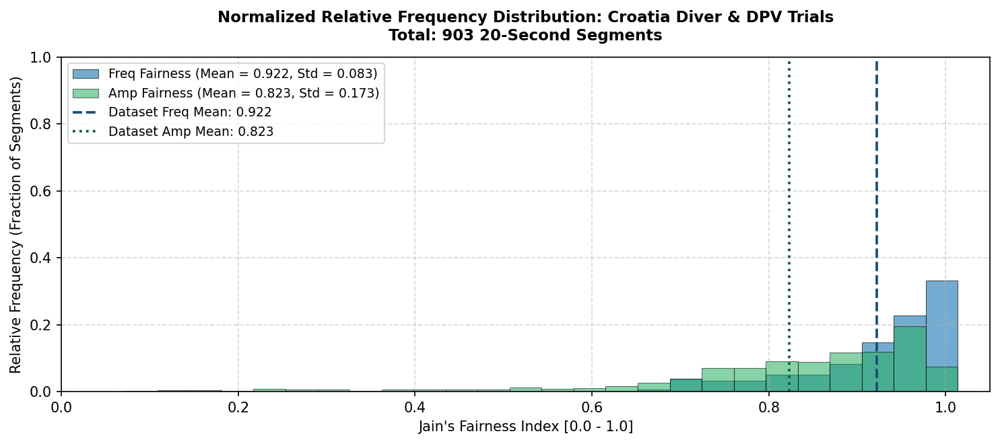

### Lake Garda Electric Craft (Overall: 241 20s segments)
- **Frequency Fairness ($J_f$):** Mean = `0.8427` (Std = `0.1498`)
- **Amplitude Fairness ($J_a$):** Mean = `0.8222` (Std = `0.1571`)
- **Mean Dominant Frequency:** `112.92 Hz`

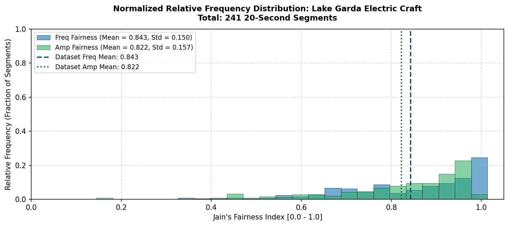

### Lake Garda Petrol Craft (Overall: 234 20s segments)
- **Frequency Fairness ($J_f$):** Mean = `0.8571` (Std = `0.1108`)
- **Amplitude Fairness ($J_a$):** Mean = `0.8419` (Std = `0.1274`)
- **Mean Dominant Frequency:** `131.52 Hz`

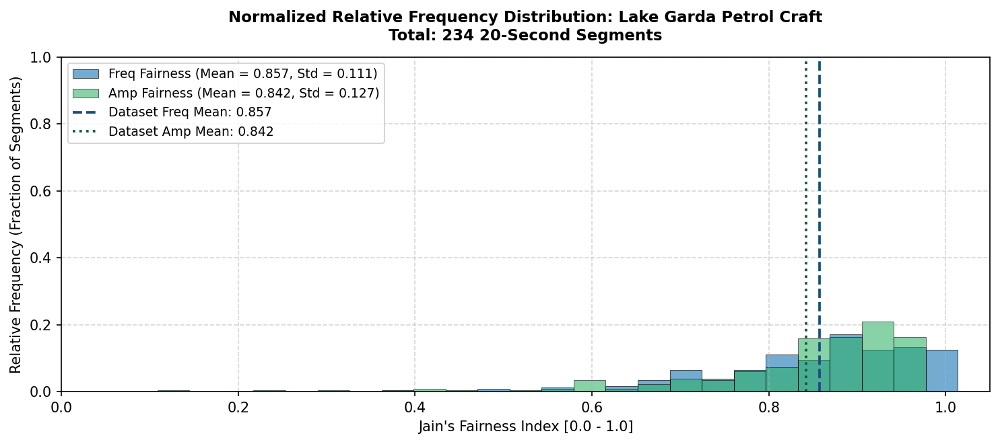

### AUV Field Trials (Overall: 909 20s segments)
- **Frequency Fairness ($J_f$):** Mean = `0.9087` (Std = `0.1389`)
- **Amplitude Fairness ($J_a$):** Mean = `0.9042` (Std = `0.1139`)
- **Mean Dominant Frequency:** `55.81 Hz`

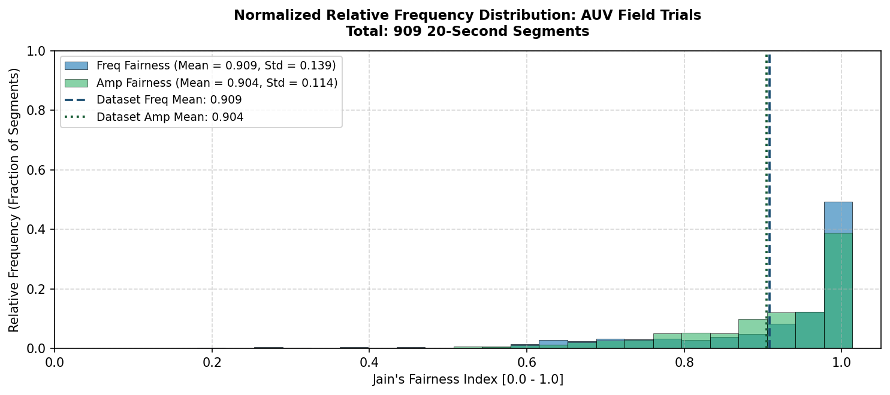

## Sub-Trial Detailed Breakdown

| Sub-Trial / Configuration | Dataset | 20s Segments | Mean $J_f$ | Mean $J_a$ | Avg Peak (Hz) | Plot Link |
| :--- | :--- | :--- | :--- | :--- | :--- | :--- |
| `AUV_Array` | AUV Field Trials | 483 | **0.881** (±0.125) | **0.882** (±0.128) | 44.4 Hz | [View Plot](images/auv/fairness_auv_array.png) |
| `AUV_Poligon_IcListen6692` | AUV Field Trials | 93 | **0.992** (±0.042) | **0.997** (±0.009) | 50.7 Hz | [View Plot](images/auv/fairness_auv_poligon_iclisten6692.png) |
| `AUV_Poligon_IcListen6695` | AUV Field Trials | 93 | **0.995** (±0.023) | **0.924** (±0.033) | 51.1 Hz | [View Plot](images/auv/fairness_auv_poligon_iclisten6695.png) |
| `AUV_StraightLine_IcListen6692` | AUV Field Trials | 120 | **0.904** (±0.211) | **0.977** (±0.050) | 104.7 Hz | [View Plot](images/auv/fairness_auv_straightline_iclisten6692.png) |
| `AUV_StraightLine_IcListen6695` | AUV Field Trials | 120 | **0.895** (±0.149) | **0.836** (±0.101) | 60.3 Hz | [View Plot](images/auv/fairness_auv_straightline_iclisten6695.png) |
| `Croatia_OceanSonics_2307_free` | Croatia Diver & DPV Trials | 192 | **0.910** (±0.086) | **0.714** (±0.186) | 448.8 Hz | [View Plot](images/croatia/fairness_croatia_oceansonics_2307_free.png) |
| `Croatia_OceanSonics_2407_1_600m` | Croatia Diver & DPV Trials | 180 | **0.854** (±0.107) | **0.811** (±0.099) | 477.0 Hz | [View Plot](images/croatia/fairness_croatia_oceansonics_2407_1_600m.png) |
| `Croatia_OceanSonics_2407_2_snake` | Croatia Diver & DPV Trials | 111 | **0.926** (±0.068) | **0.731** (±0.223) | 464.6 Hz | [View Plot](images/croatia/fairness_croatia_oceansonics_2407_2_snake.png) |
| `Croatia_OceanSonics_2507_1_1k` | Croatia Diver & DPV Trials | 270 | **0.954** (±0.047) | **0.928** (±0.093) | 872.1 Hz | [View Plot](images/croatia/fairness_croatia_oceansonics_2507_1_1k.png) |
| `Croatia_OceanSonics_2507_2_joint` | Croatia Diver & DPV Trials | 150 | **0.958** (±0.041) | **0.854** (±0.173) | 584.5 Hz | [View Plot](images/croatia/fairness_croatia_oceansonics_2507_2_joint.png) |
| `Garda_Deep_Electric` | Lake Garda Electric Craft | 153 | **0.836** (±0.136) | **0.787** (±0.143) | 100.4 Hz | [View Plot](images/garda/fairness_garda_deep_electric.png) |
| `Garda_Deep_Petrol` | Lake Garda Petrol Craft | 124 | **0.847** (±0.114) | **0.827** (±0.148) | 118.9 Hz | [View Plot](images/garda/fairness_garda_deep_petrol.png) |
| `Garda_Shallow_Electric` | Lake Garda Electric Craft | 88 | **0.855** (±0.171) | **0.883** (±0.162) | 134.7 Hz | [View Plot](images/garda/fairness_garda_shallow_electric.png) |
| `Garda_Shallow_Petrol` | Lake Garda Petrol Craft | 110 | **0.868** (±0.106) | **0.859** (±0.096) | 145.7 Hz | [View Plot](images/garda/fairness_garda_shallow_petrol.png) |

## Sub-Trial Visualizations

### `AUV_Array` (483 segments - AUV Field Trials)
- **Frequency Fairness ($J_f$):** Mean = `0.8805` (Std = `0.1252`)
- **Amplitude Fairness ($J_a$):** Mean = `0.8816` (Std = `0.1279`)
- **Mean Dominant Frequency:** `44.44 Hz`

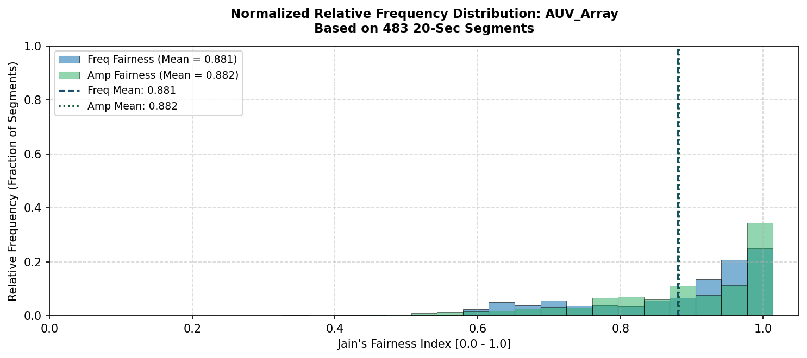

### `AUV_Poligon_IcListen6692` (93 segments - AUV Field Trials)
- **Frequency Fairness ($J_f$):** Mean = `0.9916` (Std = `0.0417`)
- **Amplitude Fairness ($J_a$):** Mean = `0.9966` (Std = `0.0091`)
- **Mean Dominant Frequency:** `50.71 Hz`

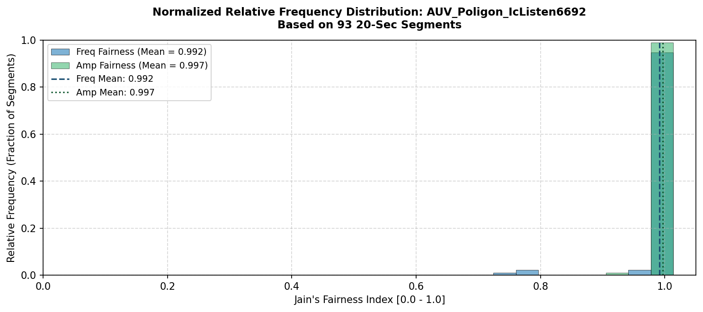

### `AUV_Poligon_IcListen6695` (93 segments - AUV Field Trials)
- **Frequency Fairness ($J_f$):** Mean = `0.9945` (Std = `0.0229`)
- **Amplitude Fairness ($J_a$):** Mean = `0.9238` (Std = `0.0333`)
- **Mean Dominant Frequency:** `51.08 Hz`

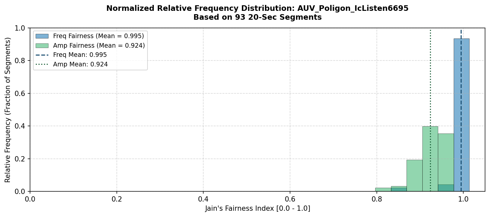

### `AUV_StraightLine_IcListen6692` (120 segments - AUV Field Trials)
- **Frequency Fairness ($J_f$):** Mean = `0.9044` (Std = `0.2112`)
- **Amplitude Fairness ($J_a$):** Mean = `0.9765` (Std = `0.0500`)
- **Mean Dominant Frequency:** `104.72 Hz`

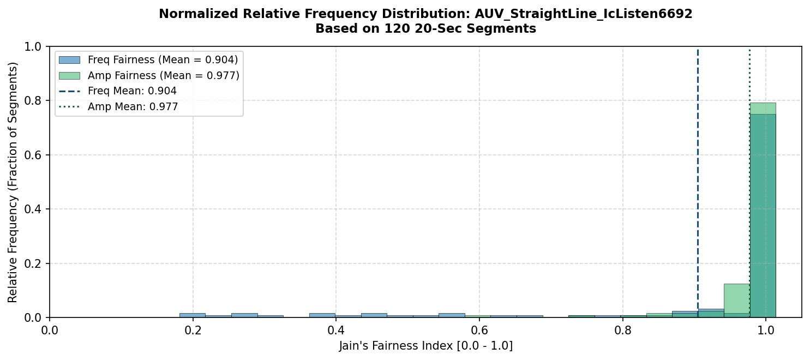

### `AUV_StraightLine_IcListen6695` (120 segments - AUV Field Trials)
- **Frequency Fairness ($J_f$):** Mean = `0.8954` (Std = `0.1492`)
- **Amplitude Fairness ($J_a$):** Mean = `0.8360` (Std = `0.1006`)
- **Mean Dominant Frequency:** `60.28 Hz`

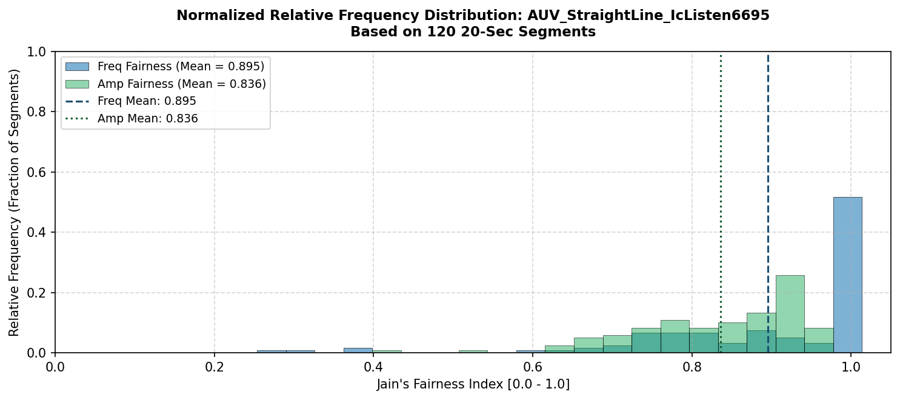

### `Croatia_OceanSonics_2307_free` (192 segments - Croatia Diver & DPV Trials)
- **Frequency Fairness ($J_f$):** Mean = `0.9101` (Std = `0.0856`)
- **Amplitude Fairness ($J_a$):** Mean = `0.7136` (Std = `0.1862`)
- **Mean Dominant Frequency:** `448.77 Hz`

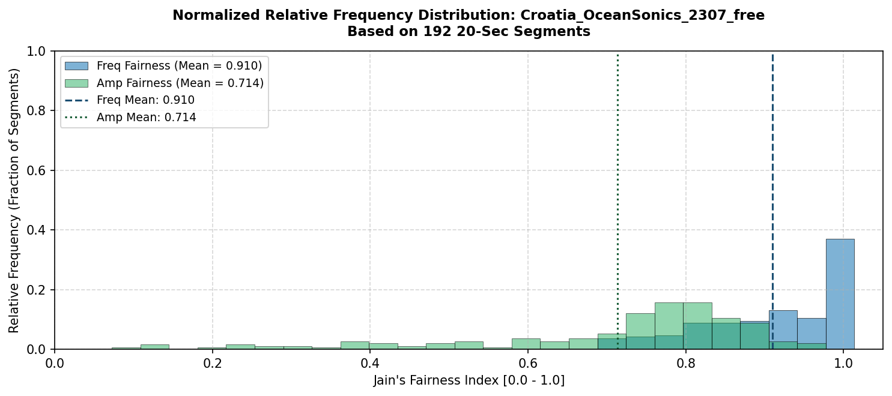

### `Croatia_OceanSonics_2407_1_600m` (180 segments - Croatia Diver & DPV Trials)
- **Frequency Fairness ($J_f$):** Mean = `0.8540` (Std = `0.1068`)
- **Amplitude Fairness ($J_a$):** Mean = `0.8113` (Std = `0.0989`)
- **Mean Dominant Frequency:** `477.00 Hz`

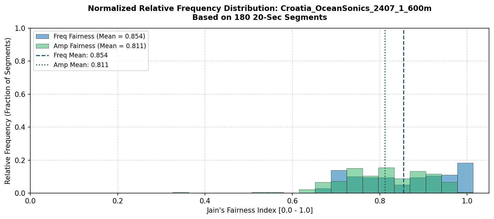

### `Croatia_OceanSonics_2407_2_snake` (111 segments - Croatia Diver & DPV Trials)
- **Frequency Fairness ($J_f$):** Mean = `0.9258` (Std = `0.0684`)
- **Amplitude Fairness ($J_a$):** Mean = `0.7310` (Std = `0.2227`)
- **Mean Dominant Frequency:** `464.64 Hz`

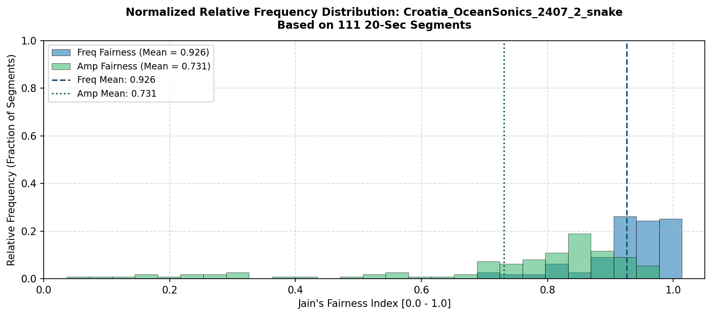

### `Croatia_OceanSonics_2507_1_1k` (270 segments - Croatia Diver & DPV Trials)
- **Frequency Fairness ($J_f$):** Mean = `0.9542` (Std = `0.0468`)
- **Amplitude Fairness ($J_a$):** Mean = `0.9282` (Std = `0.0927`)
- **Mean Dominant Frequency:** `872.09 Hz`

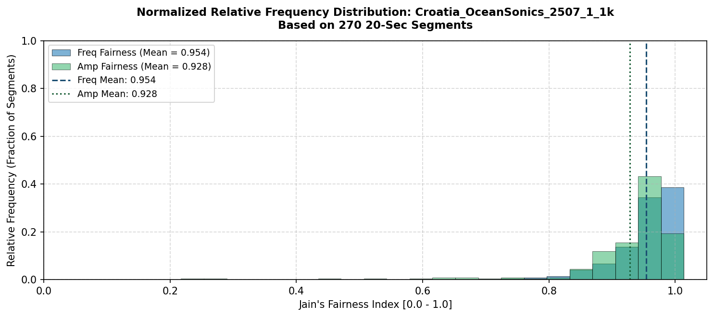

### `Croatia_OceanSonics_2507_2_joint` (150 segments - Croatia Diver & DPV Trials)
- **Frequency Fairness ($J_f$):** Mean = `0.9576` (Std = `0.0412`)
- **Amplitude Fairness ($J_a$):** Mean = `0.8541` (Std = `0.1725`)
- **Mean Dominant Frequency:** `584.53 Hz`

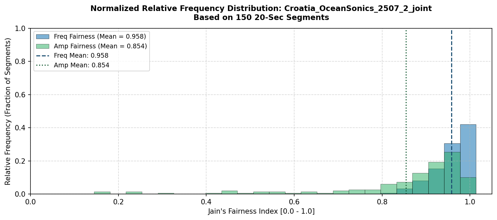

### `Garda_Deep_Electric` (153 segments - Lake Garda Electric Craft)
- **Frequency Fairness ($J_f$):** Mean = `0.8360` (Std = `0.1356`)
- **Amplitude Fairness ($J_a$):** Mean = `0.7874` (Std = `0.1430`)
- **Mean Dominant Frequency:** `100.38 Hz`

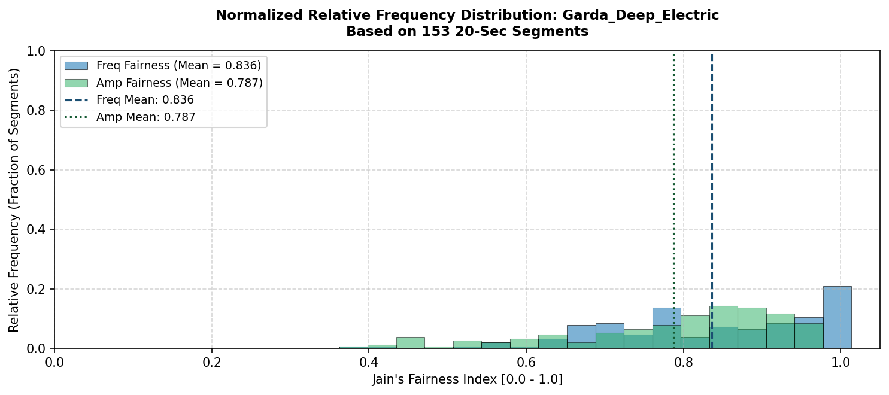

### `Garda_Deep_Petrol` (124 segments - Lake Garda Petrol Craft)
- **Frequency Fairness ($J_f$):** Mean = `0.8473` (Std = `0.1137`)
- **Amplitude Fairness ($J_a$):** Mean = `0.8270` (Std = `0.1484`)
- **Mean Dominant Frequency:** `118.91 Hz`

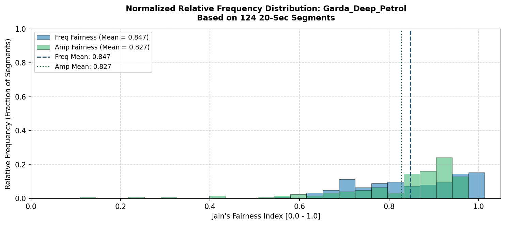

### `Garda_Shallow_Electric` (88 segments - Lake Garda Electric Craft)
- **Frequency Fairness ($J_f$):** Mean = `0.8545` (Std = `0.1711`)
- **Amplitude Fairness ($J_a$):** Mean = `0.8826` (Std = `0.1621`)
- **Mean Dominant Frequency:** `134.72 Hz`

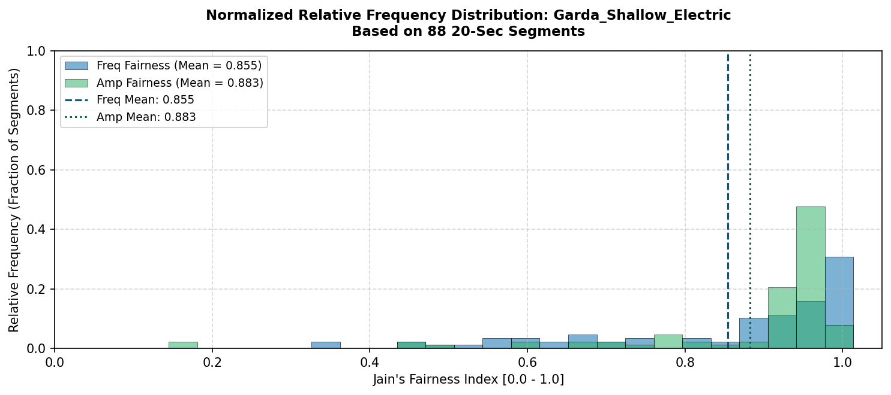

### `Garda_Shallow_Petrol` (110 segments - Lake Garda Petrol Craft)
- **Frequency Fairness ($J_f$):** Mean = `0.8682` (Std = `0.1063`)
- **Amplitude Fairness ($J_a$):** Mean = `0.8587` (Std = `0.0958`)
- **Mean Dominant Frequency:** `145.74 Hz`

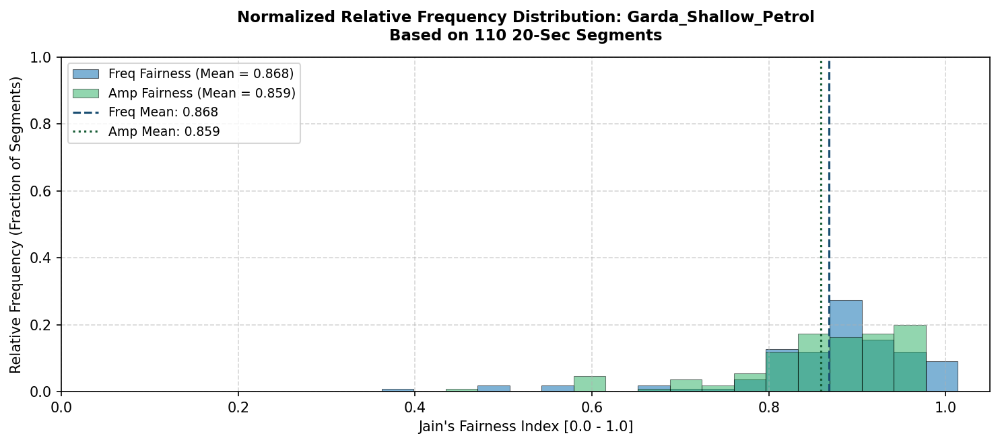

