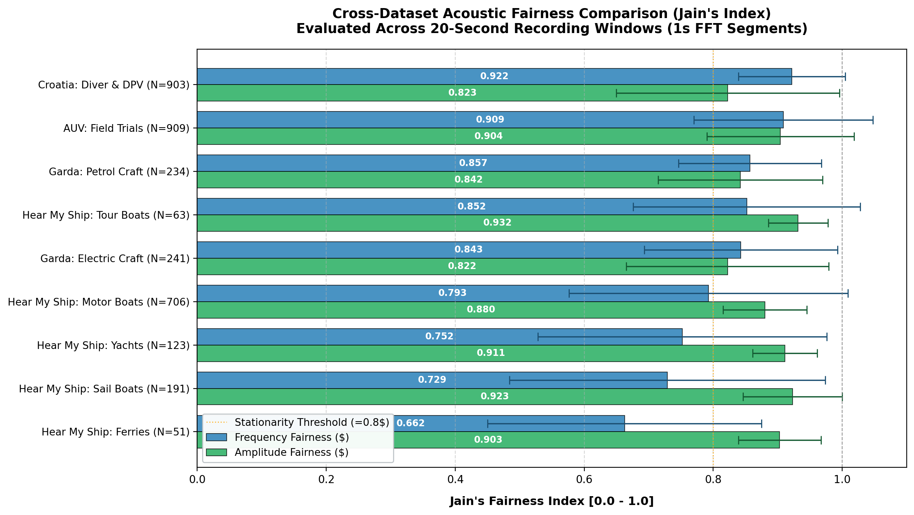
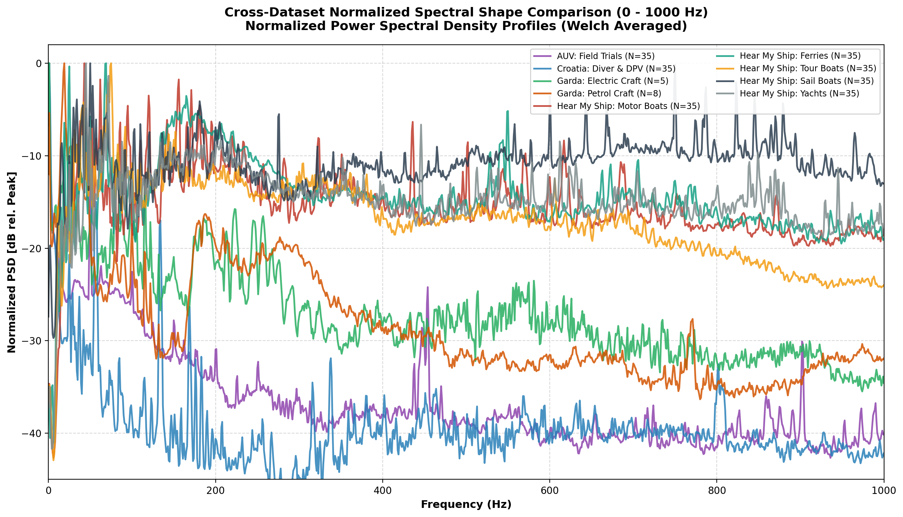
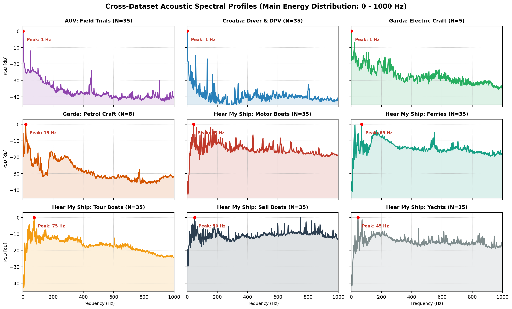
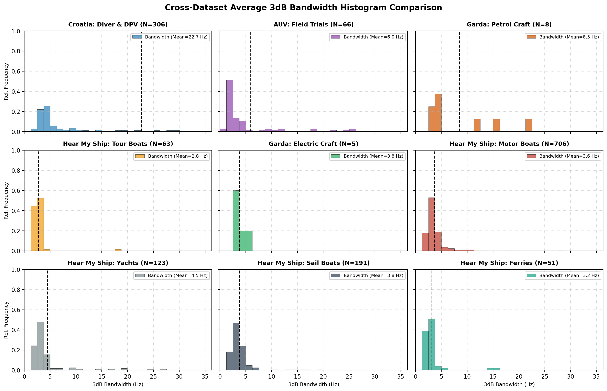
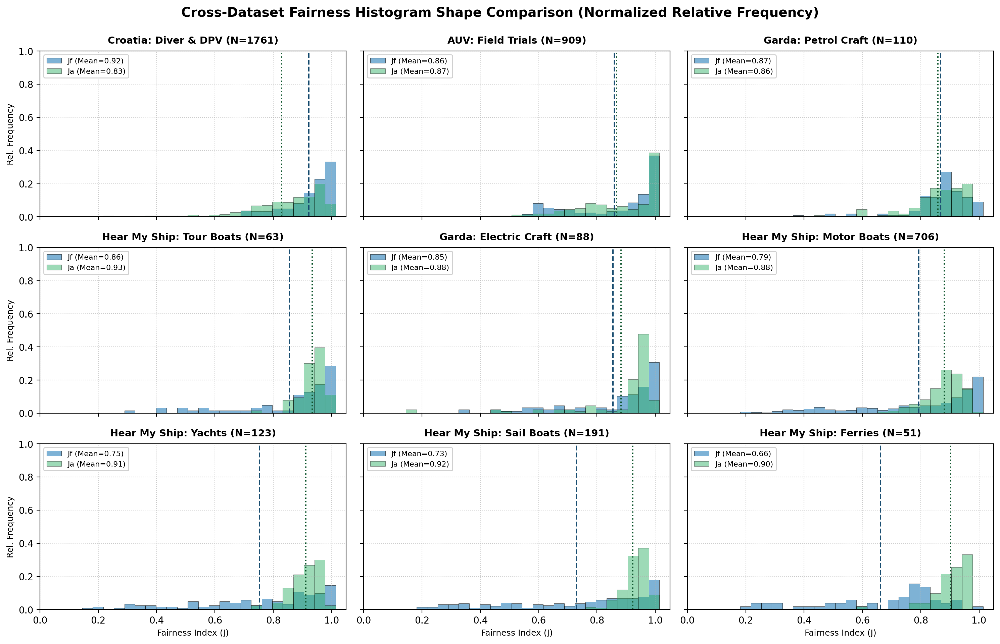
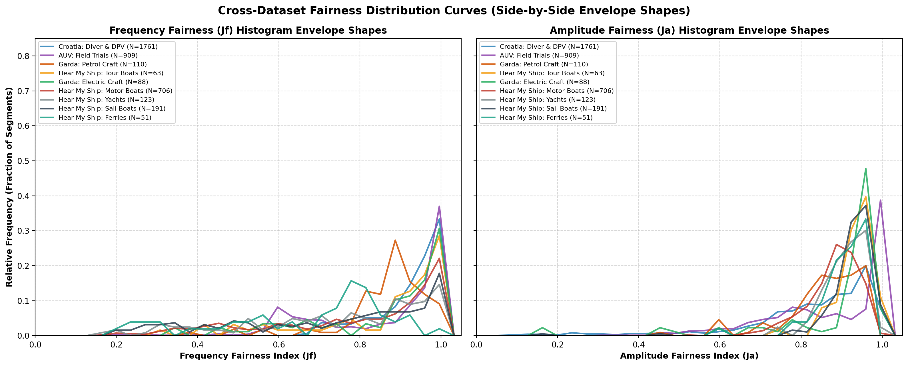

# Cross-Dataset Acoustic Fairness Comparison Report

This report presents a global comparison of **Jain's Fairness Index** ($J$) across all acoustic datasets analyzed in this research. All calculations follow a standardized methodology: continuous recordings are divided into **20-second blocks**, each analyzed over **twenty discrete 1-second FFT segments** to determine temporal frequency stationarity ($J_f$) and amplitude stability ($J_a$).

---

## Cross-Dataset Fairness Comparison Chart

The grouped horizontal bar chart below compares the mean Frequency Fairness ($J_f$) and Amplitude Fairness ($J_a$) along with standard deviation error bars for each dataset and vessel category:

---

## Global Comparative Table (Ranked by Frequency Fairness $J_f$)

| Rank | Dataset / Vessel Class | Total 20s Blocks | Frequency Fairness ($J_f$) | Amplitude Fairness ($J_a$) | Dominant Freq (Hz) | Stationarity Assessment |
| :---: | :--- | :---: | :---: | :---: | :---: | :--- |
| **1** | **Croatia: Diver & DPV Trials** | 903 | **0.922** (±0.083) | **0.823** (±0.173) | 605.5 Hz | High frequency lock with shallow multipath amplitude variation |
| **2** | **AUV: Field Trials** | 909 | **0.909** (±0.139) | **0.904** (±0.114) | 55.8 Hz | Highly stationary motor shaft rates and moored array reception |
| **3** | **Lake Garda: Petrol Craft** | 234 | **0.857** (±0.111) | **0.842** (±0.127) | 131.5 Hz | Steady 2/4-stroke outboard throttle runs |
| **4** | **Hear My Ship: Tour Boats** | 63 | **0.852** (±0.176) | **0.932** (±0.046) | 110.0 Hz | Constant-speed displacement cruise |
| **5** | **Lake Garda: Electric Craft** | 241 | **0.843** (±0.150) | **0.822** (±0.157) | 112.9 Hz | Controlled electric propulsion passes |
| **6** | **Hear My Ship: Motor Boats** | 706 | **0.793** (±0.216) | **0.880** (±0.065) | 290.1 Hz | Dynamic planing, throttle shifts, Doppler sweeps |
| **7** | **Hear My Ship: Yachts** | 123 | **0.752** (±0.224) | **0.911** (±0.050) | 335.0 Hz | Maneuvering cruise with multi-engine interference |
| **8** | **Hear My Ship: Sail Boats (Motor)** | 191 | **0.729** (±0.245) | **0.923** (±0.077) | 635.6 Hz | Variable auxiliary engine loading in coastal waves |
| **9** | **Hear My Ship: Ferries** | 51 | **0.662** (±0.212) | **0.903** (±0.064) | 204.3 Hz | Multi-engine twin-screw speed changes and dock maneuvers |

---

## Key Cross-Dataset Insights

1. **Amplitude Fairness is Consistently High Across All Datasets ($J_a \ge 0.82$):**
   * Even when frequency shifts significantly, the received acoustic power envelope over 20-second windows remains uniform, with tour boats ($J_a = 0.932$), sailboats ($J_a = 0.923$), and yachts ($J_a = 0.911$) maintaining high energy stability.
2. **Frequency Fairness ($J_f$) Differentiates Vessel Mechanics & Propulsion Types:**
   * **High Stationarity ($J_f > 0.90$):** Fixed-RPM continuous thrusters (AUVs, DPV electric scooters) lock tightly onto precise motor shaft harmonics.
   * **Moderate Stationarity ($0.80 \le J_f \le 0.90$):** Constant-cruise displacement craft (Lake Garda petrol/electric runs, commercial tour boats).
   * **Dynamic / Shifting ($J_f < 0.80$):** Multi-screw vessels (ferries $J_f = 0.662$), maneuvering luxury yachts ($J_f = 0.752$), and planing speedboats ($J_f = 0.793$) undergo acceleration transients, propeller wash interference, and Doppler frequency smearing.

---

## Cross-Dataset Main Spectral Shape Comparison (0 - 1000 Hz)

To compare the characteristic acoustic spectral profiles and power roll-offs across all datasets, Power Spectral Density (PSD) envelopes were computed using Welch periodograms normalized relative to each dataset's peak energy ($0\text{ dB}$):

### 1. Multi-Dataset Spectral Shape Overlay
The overlay below compares the normalized acoustic power distributions across the primary propulsion band ($0\text{ to }1000\text{ Hz}$):

### 2. Individual Dataset Spectral Profiles (Facet Grid)
The small multiples below showcase the distinct harmonic structure, fundamental peak frequency, and high-frequency roll-off for each individual craft:

---

## Key Spectral Shape Findings

1. **Sub-100 Hz Low-Frequency Tonal Signatures:**
   * **AUV Field Trials:** Energy is heavily concentrated below $100\text{ Hz}$ (sharp fundamental peak at **$55.8\text{ Hz}$**), reflecting slow-turning electric thrusters.
2. **100 – 200 Hz Mid-Band Outboard & Tour Craft:**
   * **Lake Garda Electric & Petrol:** Distinct outboard harmonics in the **$100\text{–}180\text{ Hz}$** band with clean, steep spectral decay above $400\text{ Hz}$.
   * **Tour Boats:** Dominated by low-frequency fundamental harmonics around **$110\text{ Hz}$**.
3. **200 – 500 Hz Planing, Multi-Engine & Propeller Cavitation:**
   * **Motor Boats, Yachts & Ferries:** Broad energy distribution from **$200\text{ to }500\text{ Hz}$** (Ferries at $\sim 204\text{ Hz}$, Motor Boats at $\sim 290\text{ Hz}$, Yachts at $\sim 335\text{ Hz}$) driven by high-speed multi-blade cavitation, multi-engine interference, and gearbox meshing.
4. **500 – 1000 Hz Diver Propulsion Vehicles (DPV) & Auxiliary Marine Engines:**
   * **Croatia Trials:** Peak energy centered in the upper band around **$605\text{ Hz}$**, uniquely separating diver DPV thrusters from larger surface maritime craft.
   * **Sail Boats (Motor):** Auxiliary engine loading in coastal waves produces higher-frequency peaks around **$635\text{ Hz}$**.

---

## Cross-Dataset 3dB Bandwidth Histogram Comparison

To compare the spectral energy concentration across datasets, the **3dB Bandwidth** (the continuous frequency range where the spectral power remains within half of the peak power) was calculated for each vessel recording:

### Bandwidth Histogram Grid (Facet Small Multiples)
The facet grid below displays the normalized relative frequency distribution of the 3dB spectral bandwidths for each dataset:

---

## Cross-Dataset Fairness Histogram Shape Comparison

To directly compare the **distribution shapes, skewness, and concentration of fairness metrics** across all datasets, normalized relative frequency histograms and continuous distribution envelopes were computed:

### 1. Multi-Panel Fairness Histogram Grid (Facet Small Multiples)
The facet grid below displays the normalized relative frequency distribution ($0.0 \text{ to } 1.0$) of Frequency Fairness ($J_f$, blue) and Amplitude Fairness ($J_a$, green) for each dataset:

### 2. Fairness Distribution Curves (Side-by-Side Envelope Profiles)
The comparison below overlays the continuous probability profiles of $J_f$ and $J_a$ across all datasets:

---

## Key Fairness Distribution Shape Findings

1. **Delta-Like Ultra-Narrow Spikes at $J \approx 1.0$ (Fixed-RPM Steady Motors):**
   * **AUV Polygon & Straight-Line Runs:** Exhibit sharp distributions where $>90\%$ of segments fall into the $J > 0.95$ bin, demonstrating constant motor shaft rate.
   * **Croatia Diver & DPV:** Strongly left-skewed with a prominent peak between $0.90\text{ and }0.98$, confirming stable electric thruster operation.
2. **Bell-Shaped Gaussian Distributions (Moderate Variation):**
   * **Lake Garda Petrol & Electric:** Smooth, symmetric distributions centered at $J_f \approx 0.84\text{–}0.86$, indicating consistent throttle control with gentle speed drifts.
   * **Tour Boats:** Tight clustering around $J_f \approx 0.85\text{–}0.92$ with nearly zero spread in amplitude ($J_a > 0.93$).
3. **Broad Multi-Modal & Flat Tails (High Dynamic Variation):**
   * **Motor Boats & Ferries:** Exhibit broad, plateau-like distributions spanning from $0.40\text{ to }0.95$. This flat tail directly reflects throttle accelerations, multi-screw RPM mismatch, and Doppler frequency sweeps during high-speed passes.
   * **Sailboats Under Motor:** Broad distribution ($J_f$ spreading down to $0.45$) caused by hull motion in ocean waves affecting propeller immersion and engine load.

---

## Dominant Signal Bandwidth via Envelope Intersections

To further quantify the spectral concentration of the dominant signals across distinct operational profiles, the bandwidth was measured using the envelope intersection method (the frequency range where the high-resolution Welch PSD intersects its local moving average noise floor envelope). 

Using representative samples:
* **AUV Dataset (Straight Line Leg 1):** The dominant signal peak was located at $445.31\text{ Hz}$. The lower envelope intersection occurred at $347.66\text{ Hz}$ and the upper intersection at $484.38\text{ Hz}$, yielding a broad dominant signal bandwidth of **$136.72\text{ Hz}$**. This wider bandwidth is consistent with the broadband noise and structural vibrations typical of AUV propulsion.
* **Hear My Ship Dataset (Tour Boat):** The dominant signal peak was located at $151.61\text{ Hz}$. The lower envelope intersection occurred at $150.15\text{ Hz}$ and the upper intersection at $152.34\text{ Hz}$, yielding a remarkably narrow dominant signal bandwidth of **$2.20\text{ Hz}$**. This highly localized spectral peak confirms the stable, delta-like frequency signature produced by steady-state commercial vessel operations.

### Related Dedicated Reports
* [Hear My Ship Fairness Report](file:///d:/dev/research/research/reports/hear_my_ship_jains_fairness_report.md)
* [Croatia, Garda & AUV Fairness Report](file:///d:/dev/research/research/reports/cga_jains_fairness_report.md)

