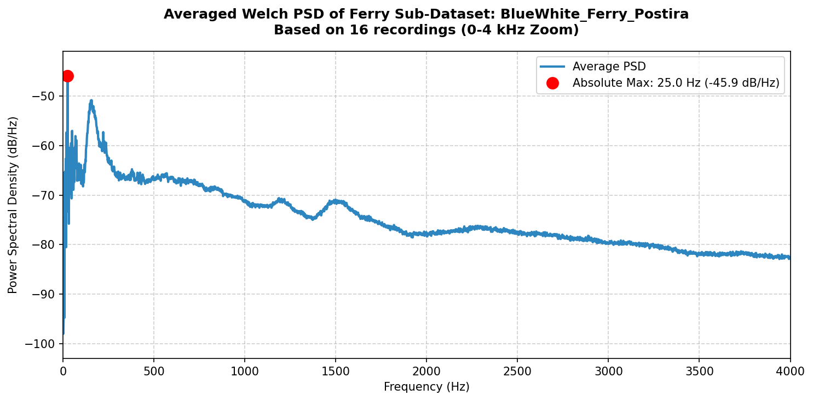
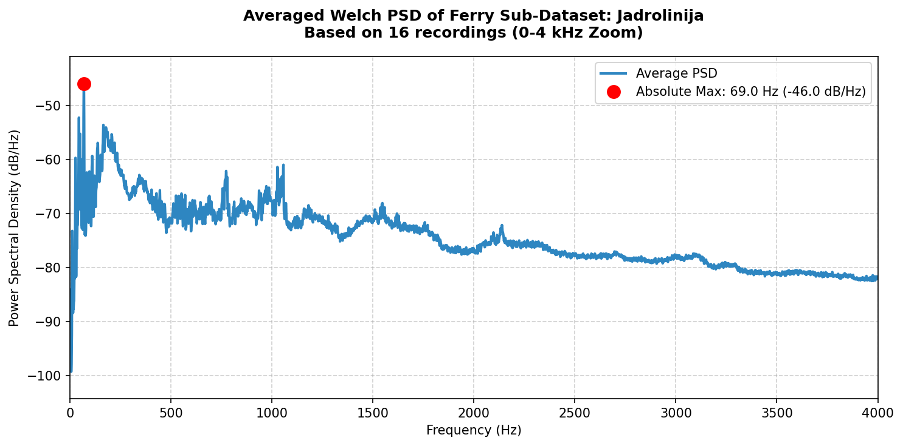
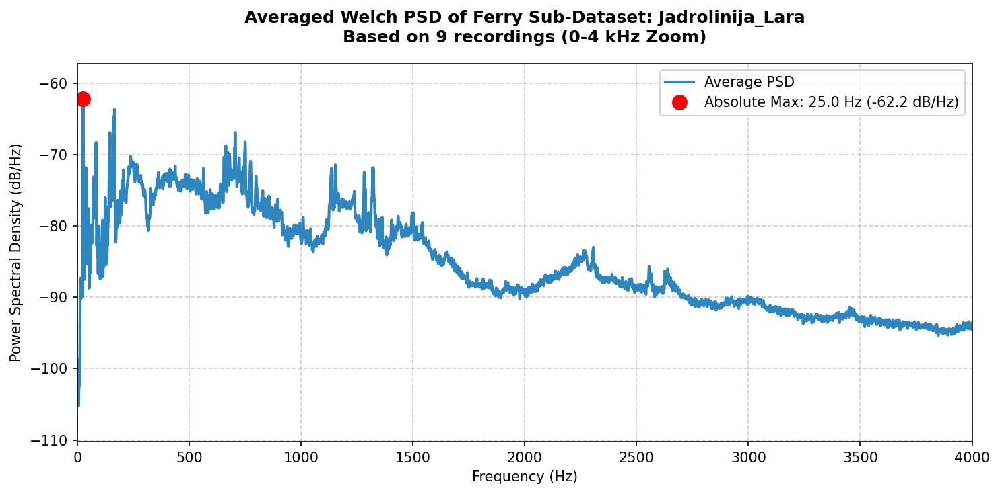
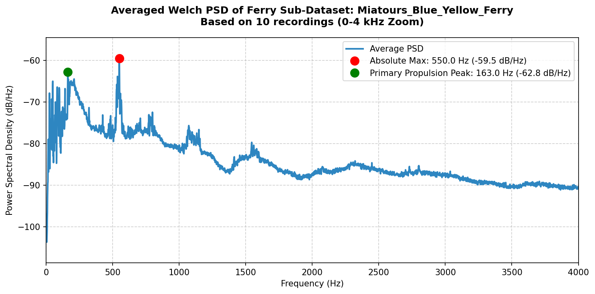

# Ferries Sub-Datasets Dominant Frequencies Report

We grouped the ferries recordings by their respective sub-datasets and averaged their Power Spectral Density (PSD) to find the dominant signatures:

| Ferry Sub-Dataset | Recordings | Absolute Max Peak (Hz) | Primary Propulsion Peak (10-200 Hz) | Plot Link |
| :--- | :--- | :--- | :--- | :--- |
| **BlueWhite_Ferry_Postira** | 16 | **25.00 Hz** (-45.9 dB) | *(Same as Max)* | [View Plot](images/hear_my_ship/ferries/ferry_avg_bluewhite_ferry_postira.png) |
| **Jadrolinija** | 16 | **69.00 Hz** (-46.0 dB) | *(Same as Max)* | [View Plot](images/hear_my_ship/ferries/ferry_avg_jadrolinija.png) |
| **Jadrolinija_Lara** | 9 | **25.00 Hz** (-62.2 dB) | *(Same as Max)* | [View Plot](images/hear_my_ship/ferries/ferry_avg_jadrolinija_lara.png) |
| **Miatours_Blue_Yellow_Ferry** | 10 | **550.00 Hz** (-59.5 dB) | **163.00 Hz** (-62.8 dB) | [View Plot](images/hear_my_ship/ferries/ferry_avg_miatours_blue_yellow_ferry.png) |

## Visualizations

### Sub-Dataset: BlueWhite_Ferry_Postira (16 recordings)
* **Absolute Maximum Spectral Peak:** 25.00 Hz  

### Sub-Dataset: Jadrolinija (16 recordings)
* **Absolute Maximum Spectral Peak:** 69.00 Hz  

### Sub-Dataset: Jadrolinija_Lara (9 recordings)
* **Absolute Maximum Spectral Peak:** 25.00 Hz  

### Sub-Dataset: Miatours_Blue_Yellow_Ferry (10 recordings)
* **Absolute Maximum Spectral Peak:** 550.00 Hz  
* **Primary low-frequency propulsion component:** 163.00 Hz *(often corresponds to the main diesel engine shaft/propeller blade rate, as the absolute maximum at 550.00 Hz is likely related to high-frequency auxiliary generators or mechanical/electrical hum)*  

