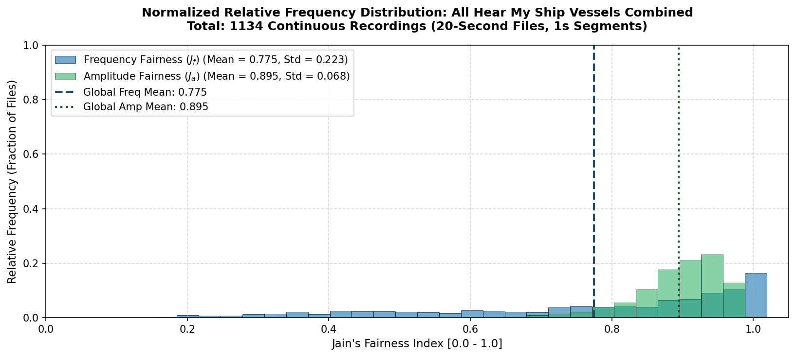
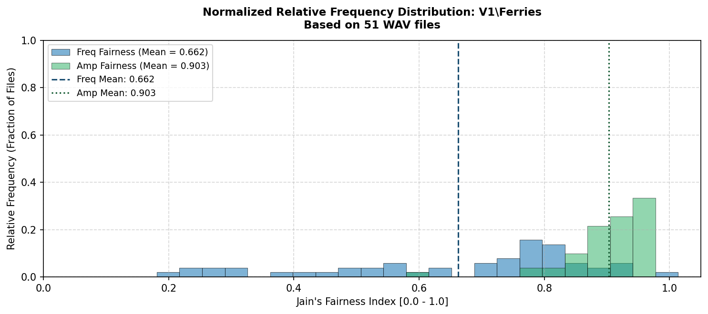
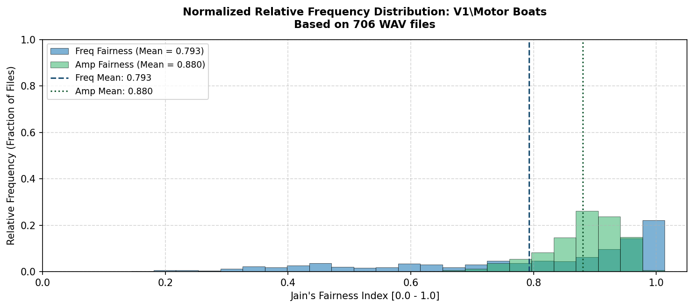
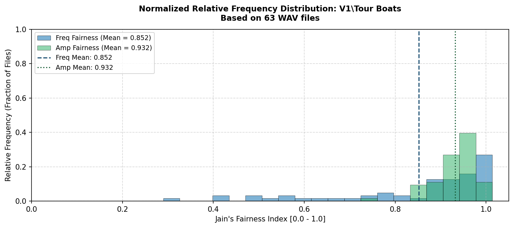
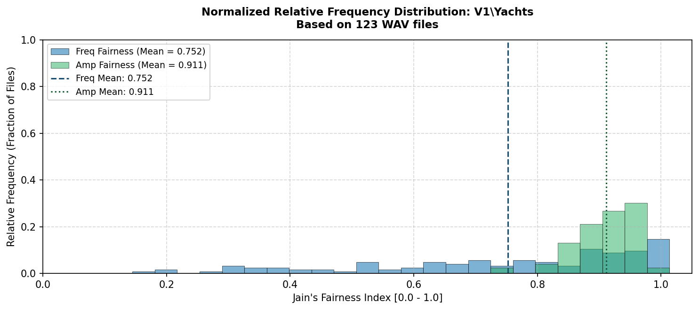

# Hear My Ship Datasets: Jain's Fairness Index Analysis

This report details **Jain's Fairness Index** ($J$) calculated across the 20 discrete 1-second segments of each 20-second recording across the entire **Hear My Ship** database ($N = 1{,}139\text{ total files}$).

### Theoretical Definition
Jain's Fairness Index measures the temporal uniformity and stability of the signal's dominant propulsion frequency and peak power:
$$J(x) = \frac{\left(\sum_{i=1}^n x_i
ight)^2}{n \sum_{i=1}^n x_i^2}$$

Where:
- $J \approx 1.0$: Highly stable, stationary tonal signal across all 20 segments (e.g. steady engine RPM and propulsion state).
- $J < 0.8$: Shifting dominant frequencies, speed variations, multipath fading, or transient wake interference.

## Overall Dataset Distribution (All Vessels Combined)

- **Total Recordings Analyzed:** `1134 files`
- **Overall Mean Frequency Fairness ($J_f$):** **`0.7750`** (±`0.2234`)
- **Overall Mean Amplitude Fairness ($J_a$):** **`0.8947`** (±`0.0675`)
- **Overall Mean Dominant Frequency:** `339.26 Hz`

## Summary Table by Vessel Class

| Sub-Dataset / Vessel Class | Total Files | Mean Freq Fairness ($J_f$) | Mean Amp Fairness ($J_a$) | Avg Dominant Freq (Hz) | Plot Link |
| :--- | :--- | :--- | :--- | :--- | :--- |
| `V1\Ferries` | 51 | **0.662** (±0.212) | **0.903** (±0.064) | 204.3 Hz | [View Plot](images/hear_my_ship/ferries/fairness_v1_ferries.png) |
| `V1\Motor Boats` | 706 | **0.793** (±0.216) | **0.880** (±0.065) | 290.1 Hz | [View Plot](images/hear_my_ship/motor_boats/fairness_v1_motor_boats.png) |
| `V1\Sail Boat (with motor)` | 191 | **0.729** (±0.245) | **0.923** (±0.077) | 635.6 Hz | [View Plot](images/hear_my_ship/motor_boats/fairness_v1_sail_boat_(with_motor).png) |
| `V1\Tour Boats` | 63 | **0.852** (±0.176) | **0.932** (±0.046) | 110.0 Hz | [View Plot](images/hear_my_ship/tour_boats/fairness_v1_tour_boats.png) |
| `V1\Yachts` | 123 | **0.752** (±0.224) | **0.911** (±0.050) | 335.0 Hz | [View Plot](images/hear_my_ship/yachts/fairness_v1_yachts.png) |

## Sub-Dataset Visualizations & Breakdown

### `V1\Ferries` (51 recordings)
- **Frequency Fairness ($J_f$):** Mean = `0.6625` (Std = `0.2124`)
- **Amplitude Fairness ($J_a$):** Mean = `0.9031` (Std = `0.0642`)
- **Mean Dominant Frequency:** `204.32 Hz`

### `V1\Motor Boats` (706 recordings)
- **Frequency Fairness ($J_f$):** Mean = `0.7927` (Std = `0.2162`)
- **Amplitude Fairness ($J_a$):** Mean = `0.8802` (Std = `0.0647`)
- **Mean Dominant Frequency:** `290.05 Hz`

### `V1\Sail Boat (with motor)` (191 recordings)
- **Frequency Fairness ($J_f$):** Mean = `0.7291` (Std = `0.2449`)
- **Amplitude Fairness ($J_a$):** Mean = `0.9230` (Std = `0.0770`)
- **Mean Dominant Frequency:** `635.58 Hz`

.png)

### `V1\Tour Boats` (63 recordings)
- **Frequency Fairness ($J_f$):** Mean = `0.8521` (Std = `0.1760`)
- **Amplitude Fairness ($J_a$):** Mean = `0.9317` (Std = `0.0464`)
- **Mean Dominant Frequency:** `109.95 Hz`

### `V1\Yachts` (123 recordings)
- **Frequency Fairness ($J_f$):** Mean = `0.7522` (Std = `0.2241`)
- **Amplitude Fairness ($J_a$):** Mean = `0.9114` (Std = `0.0500`)
- **Mean Dominant Frequency:** `334.95 Hz`

