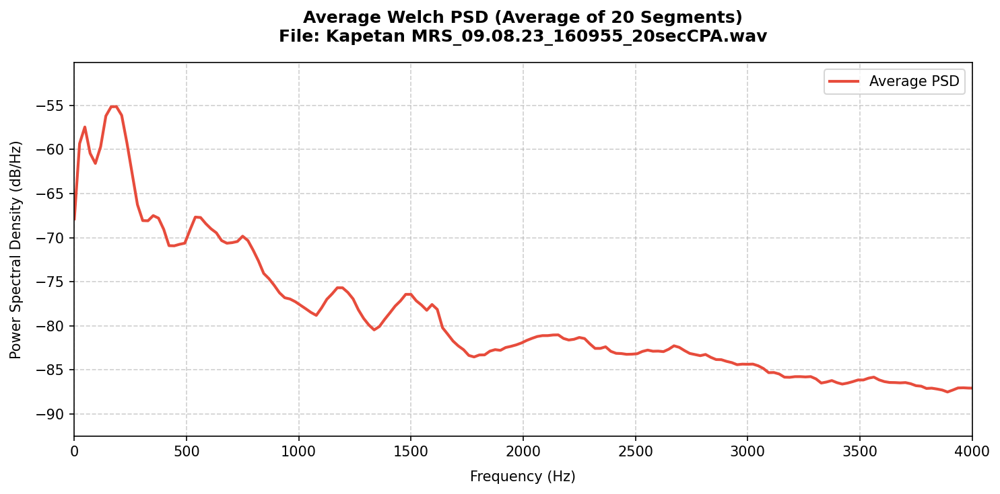

# Welch PSD Analysis Report

**File Analyzed:** `Kapetan MRS_09.08.23_160955_20secCPA.wav`  
**Full Path:** `D:\RoyStudies\Recordings\hear-my-ship\V1\Aux Vessels\Kapetan MRS_09.08.23_160955_20secCPA.wav`  
**Sample Rate:** 48000 Hz  
**Total Duration:** 20.00 seconds  
**Number of Segments:** 20 (1 second each)  

---

## Dominant Frequencies (0-4 kHz Range)
Below are the top dominant spectral peaks identified in the average Power Spectral Density (PSD) estimate:

| Rank | Frequency (Hz) | PSD (dB/Hz) |
| :--- | :--- | :--- |
| 1 | 187.50 Hz | -55.12 dB/Hz |
| 2 | 539.06 Hz | -67.67 dB/Hz |
| 3 | 1171.88 Hz | -75.69 dB/Hz |
| 4 | 2156.25 Hz | -81.04 dB/Hz |

---

## Visualizations

### Average Spectral Density

### Segmented Spectral Densities
Here is the spectral breakdown for each 1-second segment showing time-varying frequency evolution:

* **Segment 0**: [View Diagram](images/welch_segments/welch_segment_0.png)
* **Segment 1**: [View Diagram](images/welch_segments/welch_segment_1.png)
* **Segment 2**: [View Diagram](images/welch_segments/welch_segment_2.png)
* **Segment 3**: [View Diagram](images/welch_segments/welch_segment_3.png)
* **Segment 4**: [View Diagram](images/welch_segments/welch_segment_4.png)
* **Segment 5**: [View Diagram](images/welch_segments/welch_segment_5.png)
* **Segment 6**: [View Diagram](images/welch_segments/welch_segment_6.png)
* **Segment 7**: [View Diagram](images/welch_segments/welch_segment_7.png)
* **Segment 8**: [View Diagram](images/welch_segments/welch_segment_8.png)
* **Segment 9**: [View Diagram](images/welch_segments/welch_segment_9.png)
* **Segment 10**: [View Diagram](images/welch_segments/welch_segment_10.png)
* **Segment 11**: [View Diagram](images/welch_segments/welch_segment_11.png)
* **Segment 12**: [View Diagram](images/welch_segments/welch_segment_12.png)
* **Segment 13**: [View Diagram](images/welch_segments/welch_segment_13.png)
* **Segment 14**: [View Diagram](images/welch_segments/welch_segment_14.png)
* **Segment 15**: [View Diagram](images/welch_segments/welch_segment_15.png)
* **Segment 16**: [View Diagram](images/welch_segments/welch_segment_16.png)
* **Segment 17**: [View Diagram](images/welch_segments/welch_segment_17.png)
* **Segment 18**: [View Diagram](images/welch_segments/welch_segment_18.png)
* **Segment 19**: [View Diagram](images/welch_segments/welch_segment_19.png)
